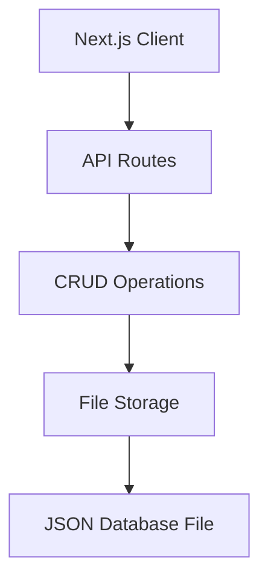

# Todo App

A Next.js and TypeScript-based TODO application with file-based persistence, featuring both API endpoints and a modern web interface.

## Overview

Task management is a universal need, but many solutions are overly complex or require constant internet connectivity. This Todo App provides a simple, reliable way to manage tasks with a modern web interface while maintaining local data control.

### Key Benefits
- Modern, responsive web interface for efficient task management
- Local data storage for privacy and accessibility
- Type-safe implementation with TypeScript
- RESTful API endpoints for potential integrations
- No external service dependencies - works offline

## Features

### Core Functionality
- Create, read, update, and delete todo items
- Persistent storage using local JSON file
- Modern web interface built with Next.js
- RESTful API endpoints for all operations
- Type-safe implementation with TypeScript

### Todo Items
Each todo includes:
- Unique ID (UUID)
- Creation date
- Content (task description)
- Completion status

## Technology Stack



### Core Technologies
- **Next.js**: Web application framework (v14.0.0)
- **React**: UI library (v18.2.0)
- **TypeScript**: Primary programming language
- **Node.js**: Runtime environment
- **UUID**: Unique ID generation

## Getting Started

### Prerequisites
- Node.js
- npm

### Installation
1. Clone the repository
2. Install dependencies:
   ```bash
   npm install
   ```
3. Start the development server:
   ```bash
   npm run dev
   ```

### Available Scripts
- `npm run dev` - Start development server
- `npm run build` - Build for production
- `npm run start` - Start production server
- `npm run lint` - Run linting

## Project Structure
```
todo_app/
├── app/                 # Next.js app directory
│   ├── layout.tsx      # Root layout
│   ├── page.tsx        # Home page
│   └── api/            # API routes
│       └── route.ts    # API handlers
├── core/
│   ├── crud.ts         # Core CRUD operations
│   └── db              # JSON database file
├── package.json
├── tsconfig.json
├── next-env.d.ts
└── memory-bank/        # Documentation
```

## API Documentation

### Data Model
```typescript
type UUID = string

interface Todo {
    id: UUID
    date: string
    content: string
    done: boolean
}
```

### API Endpoints

#### Create Todo
- Creates a new todo item
- Automatically generates UUID and timestamp
```typescript
function create(content: string): Todo
```

#### Read Todos
- Retrieves all todos
- Returns array of Todo items
```typescript
function read(): Array<Todo>
```

#### Update Todo
- Updates todo properties
- Supports partial updates
```typescript
function update(id: UUID, partialTodo: Partial<Todo>): Todo
```

#### Delete Todo
- Removes todo by ID
```typescript
function deleteById(id: UUID): void
```

## Current Status

🟢 **Phase 1 Complete**
- Basic CRUD operations
- File-based persistence
- TypeScript implementation

🟡 **Phase 2 In Progress**
- Web interface development
- API endpoints
- Enhanced TODO features
- Data validation and error handling

### Current Focus
1. Removing simulation/test code
2. Completing web interface development
3. Enhancing API endpoints
4. Implementing comprehensive error handling

## Roadmap

### Future Phases
1. User Authentication
2. Categories and Tags
3. Due Dates and Reminders
4. Multi-user Support
5. Testing Infrastructure
6. Performance Optimizations

### Technical Improvements
1. Asynchronous File Operations
2. Enhanced Error Handling
3. Input Validation
4. Comprehensive Testing
5. API Documentation
6. Loading States
7. Error Boundaries

## Contributing

### Development Guidelines
1. **Code Style**
   - Use TypeScript strict mode
   - Follow React/Next.js best practices
   - Use Server Components by default
   - Implement clear function signatures
   - Ensure type-safe operations

2. **Error Handling**
   - Implement TypeScript type checking
   - Add runtime error validation
   - Handle file system errors
   - Protect against JSON parse errors
   - Return appropriate API error responses

3. **Documentation**
   - Add code comments for complex logic
   - Update type definitions
   - Maintain memory bank documentation
   - Document API endpoints

For more detailed information about the project's architecture, patterns, and decisions, refer to the `memory-bank/` directory.

Credits: [Mario Souto](https://github.com/omariosouto)
