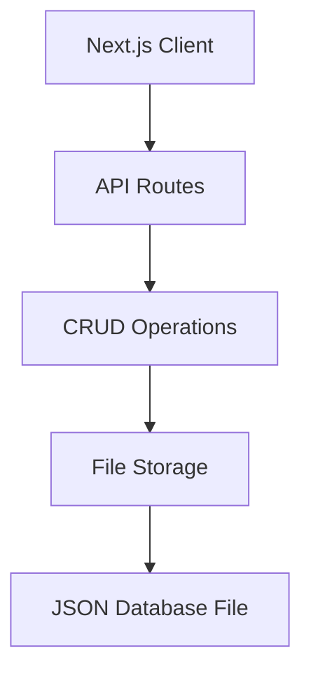

# System Patterns: Todo App

## Architecture Overview
The application follows a modern web architecture with clear separation of concerns:



## Core Components

### 1. Data Model
```typescript
type UUID = string

interface Todo {
    id: UUID
    date: string
    content: string
    done: boolean
}
```

### 2. Storage Layer
- File-based persistence using Node.js `fs` module
- JSON format for data storage
- Located at `./core/db`
- Atomic write operations
- Pretty-printed JSON (2-space indentation)

### 3. CRUD Operations
- **Create**: Adds new todos with UUID-generated IDs
  ```typescript
  function create(content: string): Todo {
    return {
      id: uuid(),
      date: new Date().toISOString(),
      content: content,
      done: false,
    }
  }
  ```
- **Read**: Retrieves all todos with fail-fast validation
  ```typescript
  function read(): Array<Todo> {
    const dbString = fs.readFileSync(DB_FILE_PATH, 'utf-8')
    const db = JSON.parse(dbString || '{}')
    if (!db.todos) return []
    return db.todos
  }
  ```
- **Update**: Supports partial updates of todo properties
  ```typescript
  function update(id: UUID, partialTodo: Partial<Todo>): Todo
  function updateContentById(id: UUID, content: string): Todo
  ```
- **Delete**: Removes todos by ID
  ```typescript
  function deleteById(id: UUID) {
    const todos = read()
    const todosWithoutOne = todos.filter((todo) => {
      if (id === todo.id) {
        return false
      }
      return true
    })
    fs.writeFileSync(DB_FILE_PATH, JSON.stringify({ todos: todosWithoutOne }, null, 2))
  }
  ```

### 4. Next.js Components
- **App Router**: Modern Next.js 14 routing system
- **Server Components**: Default to React Server Components
- **API Routes**: RESTful endpoints for CRUD operations
- **Client Components**: Interactive UI elements
- **Layout System**: Consistent page structure

## Design Patterns

### 1. Next.js Patterns
- Server-first approach with React Server Components
- API Routes for data operations
- Client components for interactive features
- Shared TypeScript interfaces
- Server-side data fetching

### 2. Module Pattern
- Core functionality encapsulated in `crud.ts`
- Clear separation between data operations and storage
- Type definitions shared across modules
- API route handlers for web interface

### 3. Interface-First Design
- TypeScript interfaces define data structures
- Strong typing ensures data integrity
- Partial types for flexible updates
- Shared types between frontend and backend

### 4. Unique Identification
- UUID-based ID generation
- Guaranteed uniqueness across todos
- Type alias for ID clarity

## Technical Decisions

### 1. Storage Format
- **Choice**: JSON
- **Rationale**:
  - Human-readable
  - Native JavaScript parsing
  - Easy debugging
  - No external dependencies
- **Implementation**:
  - Pretty-printed with 2-space indent
  - Wrapped in `todos` array
  - Atomic file operations

### 2. Next.js Implementation
- **Benefits**:
  - Server-side rendering
  - API routes
  - Modern React features
  - File-based routing
  - TypeScript support
- **Features Used**:
  - App Router
  - Server Components
  - API Routes
  - TypeScript integration
  - Layout system

### 3. TypeScript Implementation
- **Benefits**:
  - Type safety
  - Better IDE support
  - Self-documenting code
  - Reduced runtime errors
- **Features Used**:
  - Interface definitions
  - Type aliases
  - Partial types
  - Array generics

### 4. File System Storage
- **Advantages**:
  - Simple implementation
  - No external dependencies
  - Portable data
  - Easy backup
- **Operations**:
  - Synchronous for simplicity
  - Error handling for file ops
  - JSON parse protection

## Error Handling
- Graceful handling of missing database
- Type validation through TypeScript
- JSON parsing error protection
- Update operation validation
- ID existence checking
- API error responses

## Future Considerations
1. Database indexing for performance
2. Transaction support
3. Data validation middleware
4. Error logging system
5. Asynchronous operations
6. Enhanced API features
7. Testing infrastructure
8. Client-side caching
9. Real-time updates
10. Authentication system
